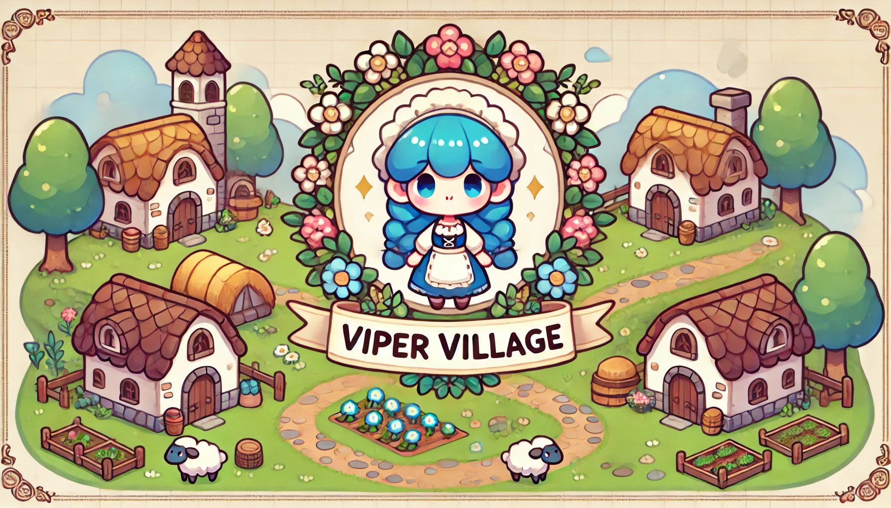
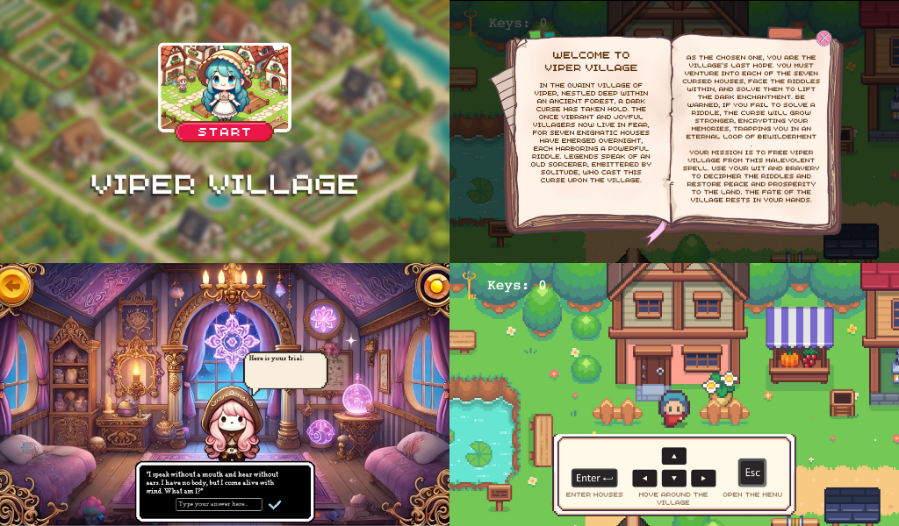
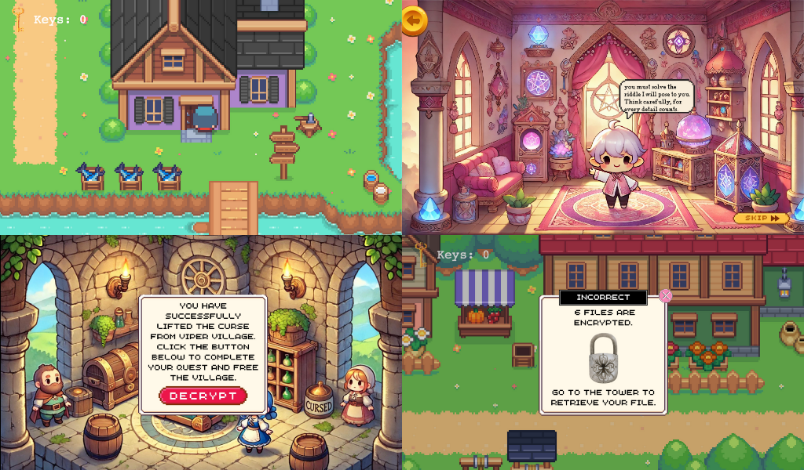
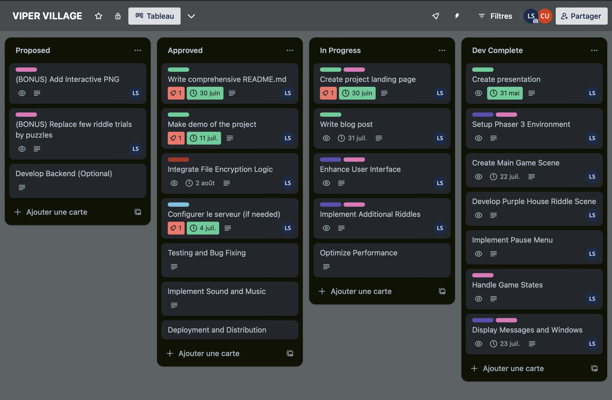

# VIPER VILLAGE


**WARNING!!! This project contains a real ransomware component.**

It encrypts files on the user's system using a randomly generated key and the Fernet symmetric encryption algorithm from the cryptography library. Once encrypted, the original files are deleted, and the user is prompted to finish the game to retrieve their files.

**Install at your own risk!** This project is intended for educational purposes only. Do not use this project with malicious intent. The authors do not take any responsibility for any misuse of this project.

## Table of Contents

- [Introduction](#introduction)
- [Features](#features)
- [Screenshots](#screenshots)
- [Installation and Usage](#installation-and-usage)
- [Project Structure](#project-structure)
- [Contributing](#contributing)
- [Trello Board](#trello-board)
- [License](#license)
- [Contact](#contact)
- [Authors](#authors)

## Introduction

**Viper Village** is a web-based RPG game that immerses players in a thrilling quest to lift a curse plaguing a mysterious village. In this game, players must solve intricate puzzles to progress and ultimately lift the curse. However, the stakes are high: failure to solve these puzzles triggers a real file encryption challenge on the player's local machine, simulating the effects of ransomware. This unique blend of gameplay and cybersecurity provides an engaging and educational experience, highlighting the importance of solving problems under pressure and understanding the implications of digital security threats.


## Features

- **Immersive Storyline**: Dive into a rich narrative where every decision and riddle solution impacts the fate of Viper Village.
- **Challenging Riddles**: Test your problem-solving skills with a variety of intricate riddles designed to challenge players.
- **Real-World Consequences**: Experience a unique twist where failing to solve riddles triggers a real file encryption challenge, simulating ransomware.
- **Dynamic Environments**: Explore beautifully crafted environments within the village, each with its own unique challenges and secrets.
- **Educational Gameplay**: Learn about cybersecurity and the importance of digital security in a fun and interactive way.
- **Rewarding Riddle Solutions**: Solve riddles to earn keys; collect three keys to access the tower and recover your encrypted files.


## Screenshots




## Installation and Usage

Here is the step-by-step tutorial on how to install and run the project:

### Installation

1. **Clone the repository**:

    ```bash
    git clone https://github.com/L344S/viper-village
    ```

2. **Navigate to the project directory**:

    ```bash
    cd viper-village
    ```

3. **Make the script executable** (if not already executable):

    ```bash
    chmod +x start-game.sh
    ```

4. **Install dependencies and start the server**:

    ```bash
    ./start-game.sh
    ```

This script will:
- Install all Node.js and Python dependencies.
- Start the game server.

### Connecting to the Game

Ensure the server is running. The script will provide a link in the console output. Open your web browser and navigate to the provided link, which typically looks like:

```plaintext
http://123.0.0.1:5502/src/html/index.html
````
### Playing the Game

**Objective**: Solve riddles to lift the curse on Viper Village. Each riddle you solve rewards you with a key. Collect three keys to access the tower and recover your encrypted files.

**Failure Consequence**: If you fail to solve a riddle, it will trigger a real file encryption challenge, simulating ransomware on your local machine.

### Controls

- **Movement**: Use the arrow keys to move your character.
- **Interaction**: Press the `ENTER` key to interact with houses.
- **Menu**: Press the `Esc` key to open the game menu.

### Troubleshooting

- **Server Issues**: If the server fails to start, ensure that all dependencies are correctly installed and that no other processes are using the same port.
- **Game Performance**: For the best experience, use a modern web browser and ensure your system meets the minimum requirements.
- **Decryption Issues**: If you encounter problems with file decryption from the browser, such as if your PC shuts down during the game or other emergencies, you can manually trigger the decryption via the console by running the following script:

    ```bash
    python3 src/python/decrypt.py
    ```

### Exiting the Game

To exit the game, simply close the web browser tab or window. To stop the server, press `Ctrl+C` in the terminal where the server is running.


## Project Structure

The project directory is organized as follows :

- **.gitignore**: Specifies files and directories to be ignored by Git to prevent them from being committed to the repository.
- **assets/**: Contains all the game's assets, including audio and visual files.
  - **audio/**: Directory for audio files used in the game.
  - **visual/**: Directory for visual assets, further categorized into subdirectories such as buttons, dialogues, maps, objects, scenes, sprites, and windows.
- **data/**: Contains game data and configuration files.
  - **archives/**: Stores old scripts and archives.
  - **collisions.js**: Contains data for collisions between game objects.
  - **map.json**: JSON file that holds the map configuration for the game.
- **encryption_key.key**: File that holds the key used for encrypting and decrypting files within the game.
- **logs/**: Contains log files that record events related to encryption and decryption.
  - **decryption_log.log**: Log file for decryption events.
  - **encryption_log.log**: Log file for encryption events.
- **package.json**: Defines Node.js project dependencies and scripts.
- **README.md**: Project documentation file that provides instructions and information about the project.
- **requirements.txt**: Lists the Python packages required to run the project.
- **src/**: Contains the source code for the project.
  - **css/**: Directory for CSS files used for styling the game interface.
    - **style.css**: Main CSS file for the game.
  - **html/**: Directory for HTML files.
    - **index.html**: Main HTML file for the game interface.
  - **js/**: Directory for JavaScript files that handle game logic.
    - **helpers/**: Contains helper scripts and additional assets like fonts.
      - **animate-text.js**: Script for animating text.
      - **Pixel Times.ttf**: Font file.
      - **Pixel Times Bold.ttf**: Bold version of the font.
      - **typewriterEffect.js**: Script for creating a typewriter effect.
    - **index.js**: Main JavaScript file for initializing the game.
    - **scenes/**: Contains scripts for different game scenes.
      - **game-scene.js**: Script for the main game scene.
      - **green-house-riddle.js**: Script for the green house riddle scene.
      - **intro-scene.js**: Script for the introduction scene.
      - **menu-scene.js**: Script for the main menu scene.
      - **pink-house-riddle.js**: Script for the pink house riddle scene.
      - **purple-house-riddle.js**: Script for the purple house riddle scene.
      - **tower-scene.js**: Script for the tower scene.
    - **server.js**: Script for running the game server.
  - **python/**: Directory for Python scripts.
    - **decrypt.py**: Script for decrypting files.
    - **encrypt.py**: Script for encrypting files.
- **start-game.sh**: Shell script to install all necessary dependencies and start the game server.

## Contributing

1. Fork the project
2. Create a new branch (`git checkout -b feature/feature-name`)
3. Make your changes
4. Commit your changes (`git commit -m 'Add some feature'`)
5. Push to the branch (`git push origin feature/feature-name`)
6. Open a Pull Request

## Trello Board

Here is the link to our Trello board to follow the future steps and project progress:
[Trello Board](https://trello.com/invite/b/663e994f0f4a511b7a560324/ATTI5d4a2120b3032ba5b2d8cf10322975241E8BDCBA/viper-village)



## License

This project is licensed under the MIT License - see the [LICENSE](LICENSE) file for details.

## Contact

If you have any questions or need further information, feel free to contact me at the provided email address.
- Email: prosel.lea@gmail.com

## Authors

- **Léa S.**:
  - [GitHub](https://github.com/L344S)
  - [LinkedIn](https://www.linkedin.com/in/léasel/)

- **Anas Batti**:
  - [GitHub](https://github.com/Yazgahar)
  - [LinkedIn](https://www.linkedin.com/in/anas-batti-a354b913b/)
